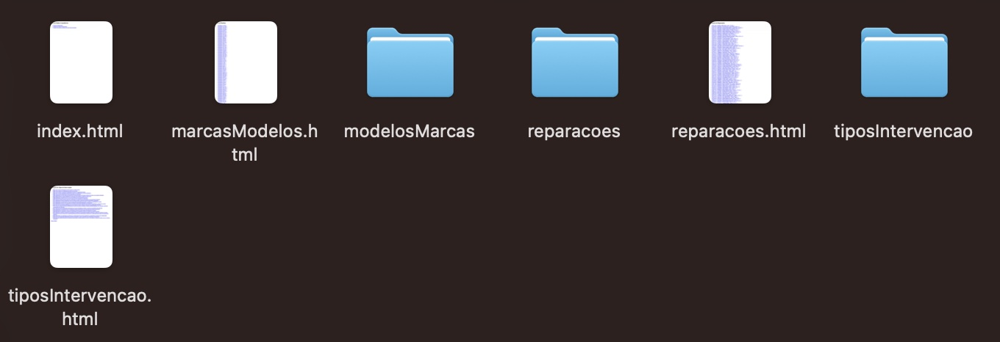

# Website de exploração de um dataset de reparações
## Data: 04-02-2025
## UC: Engenharia Web (EW)

# Autor
## Nº Aluno: A106904
## Nome: Diogo Alves Ferreira
## Foto: 

## Resumo
Este projeto consiste num script python que gera automaticamente páginas HTML através da informação presente num ficheiro JSON de reparações. 

## Divisão do Projeto
Este projeto está divido em:
    1. Uma página index.html, que é a página inicial que mostra quais os tipos de dados mostrados (Reparações, Tipos de Intervenções e Modelos/Marcas);
    2. Três página de índice, uma para cada um dos tipos de dados, ou seja, uma página para índice de Reparações, uma para índice de Tipos de Intervenção, etc.;
    3. Uma página para ver todos os dados de uma dada Reparação, Tipo de Intervenção ou Modelo/Marca.

## Organização dos ficheiros no projeto

Tendo o dataset e o script Python que o converte em HTML, as páginas geradas são colocadas na pasta output. Dentro desta página estão as páginas que servem de índice, e 3 pastas com todas as páginas geradas para Reparações, Tipos de Intervenção e Modelos/Marca.

## Dados Listados
    1. Índice Reparações: Data-NIF-Nome-Modelo-Marca-Nr Intervencoes
        1.1.Reparação: Nome-NIF-Data-Marca-Modelo-Matrícula-Nr Intervenções-Lista de Intervenções da reparação

    2. Índice Tipos de Intervenção (Ordenado alfabeticamente): Codigo-Nome-Descrição
        2.1.Tipo de Intervenção: Código-Nome-Descrição-Lista de Reparações desse Tipo

    3. Índice Modelo/Marca (Ordenado alfabeticamente): Modelo-Marca-Quantidade de carros da mesma marca e modelo
        3.1.Marca/Modelo: Marca-Modelo-Lista de Matrículas desse modelo

